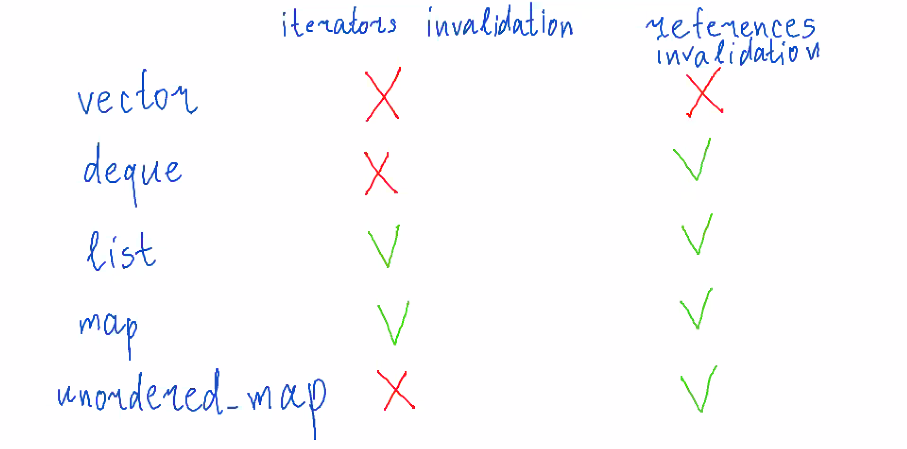

**referenceс invalidation** - указатели на элемент становятся невалидными.



## 8.3. Iterators hierarchy
### 1. Input iterator

Умеет: *it, ==, ++it.

Не гарантирует, что второй раз мы пройдем по тому же самому массиву.
То есть если мы скопируем it, потом начнем его инкрементить после первого прохода, будет UB.

Примеры: istream_iterator, ostream_iterator.

### 2. Forward iterator

Гарантирует, что второй раз мы пройдем по тому же самому массиву.

Примеры: forward_list::iterator, unordered_map, unordered_set.

### 3. Bidirectional iterator

Forward iterator, поддерживающий --it.

Примеры: list::iterator, set, map.

### 4. Random access iterator

Bidirectional iterator, поддерживающий <, >, >=, <=, += n, -= n.

Пример: deque.

### 5. Contiguous Iterator

Random access iterator, гарантирующий, что элементы лежат подряд.

То есть если сделать `&(*it) + 1`, ты получите следующий объект.

Примеры: vector, array, так же подходят обычные указатели.

## 8.4. std::advance, std::distance
`std::next(it)` - получить следующий итератор за it.

`std::advance(it, n)` - сдвинуть итератор на n. n может быть отрицательным, но если не Bidirectional iterator, то будет UB.

Реализация advance (будем считать, что n > 0):

```cpp
template <typename Iterator, typename IterCategory>
void my_advance_helper(Iterator& iter, int n, IterCategory) {
    for (int i = 0; i < n; ++i) {
        ++iter;
    }
}

template <typename Iterator>
void my_advance_helper(Iterator& iter, int n, std::random_access_iterator_tag) {
    iter += n;
}

template <typename Iterator>
void my_advance_helper(Iterator& iter, int n, std::contiguous_iterator_tag) {
    iter += n;
}

template <typename Iterator>
void my_advance(Iterator& iter, int n) {
    my_advance_helper(iter, n, typename std::iterator_traits<Iterator>::iterator_category());
}
/*
template <typename T>
struct iterator_traits {
    using value_type = ...; // что получается при разыменовании.
    using iterator_category = ...'
};
// в iterator_category может быть
struct input_iterator_tag {};
struct forward_iterator_tag: public input_iterator_tag {};
...
*/
```

`std::distance(it1, it2)` - расстояние. Если от it1 не достижим it2, до будет UB.

## 8.5. Const- and reverse-iterators.
**const iterator** - итератор, запрещающий менять значение.

В случае с перегрузкой `operator->` нужно вернуть указатель, а компилятор сам добавит еще одну стрелочку.

Пример стрелочки со звездочкой:
```cpp
struct S {
    int a;
    int b;
};

int main() {
    int S::* p = S::a;
    S s;
    s.*p = 1;
    S* ps = &s;
    ps->*p = 2;
}
```

Реализация const iterator на примере iterator к Vector.
```cpp
// всё это внутри Vector
template <bool IsConst>
struct common_iterator {
private:
    using ConditionalPtr = std::conditional_type<IsConst, const T*, T*>;
    ConditionalPtr ptr;
    // далее заменяем все T* на ConditionalPtr
    ...
};
using iterator = common_iterator<false>;
using const_iterator = common_iterator<true>;
```

Про reverse iterator:
```cpp
template <typename Iterator>
class reverse_iterator {
    Iterator iter;
public:
    Iterator base() const  {
        return iter;
    }
    reverse_iterator<Iterator>& operator++() {
        --iter;
        return *this;
    }
    reverse_iterator<Iterator>& operator+=(int n) {
        iter -= n;
        return *this;
    }
    ...
};
```

## 8.6. Output iterators.
**Output iterator** - такой итератор, который можно инкрементировать и присваивать значение под ним. 
Все обычные контейнеры не поддерживают output iterators, т.к. есть верхняя граница end().

Если написать 
```cpp
int main() {
    std::vector<int> v(10);
    for (int i = 0; i < 10; ++i) {
        v[i] = i;
    }
    std::vector<int> vv;
    std::copy(v.begin(), v.end(), vv.begin());
}
```
то будет беда, т.к. vector не поддерживает output iterators.

Поэтому есть back_inserter. Вот реализация:

```cpp
template <typename Container>
struct back_insert_iterator {
private:
    Container& container;
public:
    back_insert_iterator(Container& container): container(container) {}
    back_insert_iterator<Container>& operator++() {
        return *this;
    }
    back_insert_iterator<Container>& operator++() {
        return *this;
    }
    // если не поддерживается value_type в контейнере, то можно написать
    // std::iterator_traits<Container::iterator>::value_type
    back_insert_iterator<Container>& operator=(const typename Container::value_type& value) {
        container.push_back(value);
        return *this;
    }
};

template <typename Container>
back_insert_iterator<Container> back_inserter(Container& c) {
    return back_insert_iterator<Container>(c);
}
```
его (back_insert_iterator) можно написать для любого контейнера, поддерживающего push_back. Аналогично front_insert_iterator.
Теперь можно написать `std::copy(v.begin(), v.end(), back_insert_iterator<std::vector<int>>(vv));` или `std::copy(v.begin(), v.end(), back_inserter(vv));`.

Есть еще insert_iterator. Он еще хранит `Container::iterator iter;`, присваивание выглядит так: 

```cpp
auto new_iter = container.insert(iter, value);
return *new_iter;
```

## 8.7. Isteam and ostream iterators.
istream_iterator нужен для прохода по вводу. ostream_iterator - по выводу.
```cpp
template <typename T>
struct istream_iterator {
private:
    std::istream& stream;
    T value; // чтобы избежать битой ссылки при разыменовании
public:
    istream_iterator(std::istream& stream): stream(stream) {}
    istream_iterator<T>& operator++() {
        stream >> value;
        return *this;
    }
    T& operator*() {
        return value;
    }
};
```

```cpp
//ostream_iterator - всё то же самое, только нужно заменить istream на ostream и добавить
ostream_iterator<T>& operator=(const T& value) {
    stream << value;
    return *this;
}
```