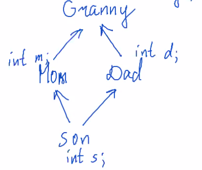
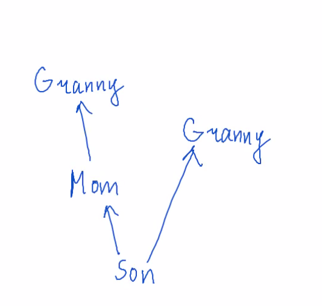

## 4.3 Order Of constructors and destructors

Все деструкторы вызываются в обратном порядке относительно вызова конструкторов

Сначала вызываются конструкторы родителей, потом наследников.
Пример: 

```cpp 
struct Mom {
    int x = 0;
    Mom(int x) :x(x){}
};
struct Son: public Mom {
    Son(int x) :Mom(x) {}
};
```
так можно инициализировать только прямых родителей класса.

```cpp 
...
struct Son: public Mom {
    ...
    using Mom::Mom;
};
```
Теперь у Son есть все конструкторы Mom. (т.е. `Son(1)` сделает `x=1`)

## Casts between base and derived classes.

```cpp
struct Base {
    ...
    int a = 0;
};
struct Derived: public Base {
    ...
    int a = 1;
};
void f(Base& b) {
    std::cout << b.a << '\n'; //0
}
int main() {
    Derived d;
    f(d);
}
```
если убрать `&` из f, то вызовется конструктор копирования Base.

Еще пример:
```cpp
...
int main() {
    ...
    Base& b = d; // при private наследовании так нельзя делать
    std::cout << sizeof(b) << ' '  << sizeof(d); // 4 8
}
```
Так можно, но не нужно:
```cpp
...
int main() {
    ...
    Derived& dd = static_cast<Derived&>(b);
}
```

## 4.5. Multiple inheritance
Так можно:
```cpp
struct Mom {
    int m;
};
struct Dad {
    int d;
};
struct Son: public Mom, public Dad {
    int s;
};
int main() {
    Son s;
    std::cout << sizeof(s); // 12
}
```

Так нельзя (CE):

```cpp 
struct Mom {
    void f() {}
};
struct Dad {
    void f() {}
};
struct Son: public Mom, public Dad {
    int s;
};
int main() {
    Son s;
    s.f();
}
```
нужно указать явно указать `s.Mom::f()`;
## 4.6. Diamond problem and ambiguos casts
Ромбовидное наследование (diamond problem):



`s.g` - CE, т.к. `g` есть и у `Mom`, и у `Dad`. Нужно явно указывать `s.Mom::g`.

Inaccessible base class:



`s.g` - CE. `s.Mom::g` - OK. Но ко второму `g` нельзя обратиться.

Не CE:

```cpp
struct Mom{...};
struct Dad{...};
struct Son: public Mom, public Dad {...};
int main() {
    Son s;
    Dad* d = &s; // указатель сдвинется
    std:: cout << &s << ' ' << d << '\n';
}
```

## 4.7. Virtual inheritance
Granny только один:
```cpp
struct Granny {
    int g = 0;
}
struct Mom: public virtual Granny {
    int m = 1;
}
struct Dad: public virtual Granny {
    int d = 1;
}
struct Son: public Mom, public Dad {
    int s = 3;
}
```
причему Granny, скорее всего, лежит в памяти после Mom, Dad, Son.
Но это очень накладно по памяти и по времени (прыжки по указателям)