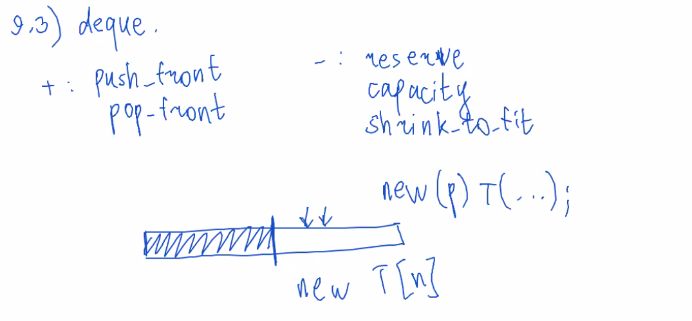
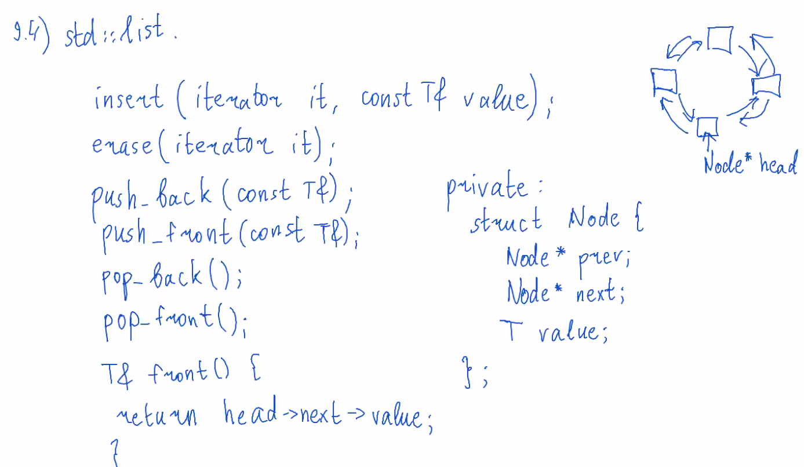
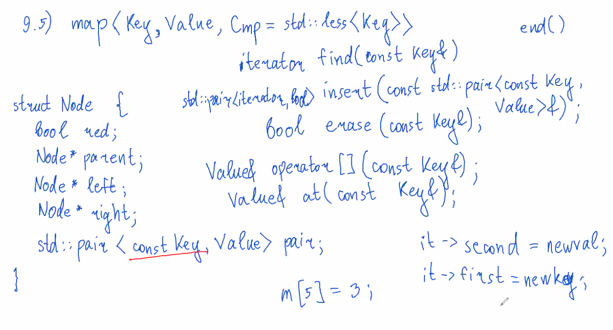

# XIX. Containers.
## 9.1. Vector implementation
Реализация на хор5:
```cpp
template <typename T>
class Vector {
private:
    T* arr;
    size_t sz;
    size_t cap;
public:
    // size_t size() const
    // size_t capacity() const
    void resize(size_t n, const T& value = T()) {
        if (n > cap)
            reserve(n);
        for (size_t i = sz; i < n; ++i) {
            arr[i] = value;
        }
        if (n < sz)
            sz = n;
    }
    void reserve(size_t n) {
        if (n <= cap) return;
        // чтобы не вызывать конструкторы по умолчанию
        T* newarr = reinterprec_cast<T*>(new int8_t[n * sizeof(T)]);
        size_t i = 0;
        try {
            std::uninitialized_copy(arr, arr + sz, newarr)
        } catch(...) {
            delete[] reinterpret_cast<int8_t*>(newarr);
            throw;
        }
        /*try {
            // выше написано то же самое, что тут:
            for (; i < sz; ++i) {
                // placement new
                // чтобы не вызывать присваивание
                new (newarr + i) T(arr[i]);
            }
        } catch(...) {
            for (size_t j = 0; j < i; ++j) {
                (newarr + i)->~T();
            }
            delete[] reinterpret_cast<int8_t*>(newarr);
            throw;
        }*/
        for (size_t i = 0; i < sz; ++i) {
            arr[i].~T();
        }
        delete[] reinterpret_cast<int8_t*>(arr);
        arr = newarr;
        cap = n;
    }
    void resize(size_t n, const T& value = T()) {
        if (n > cap)
            reserve(n);
        for (size_t i = sz; i < n; ++i) {
            // не exception safety
            new (arr + i) T(value);
        }
        if (n < sz)
            sz = n;
    }
    void push_back(const T& value) {
        if (cap === sz) {
            reserve(2 * sz);
            return;
        }
        new (arr + sz++) T(value);
    }
    void pop_back() {
        --sz;
        (arr + sz)->~T();
    }
    T& operator [](size_t i) {
        return arr[i];
    }
    const T& operator [](size_t i) const {
        return arr[i];
    }
    T& operator at(size_t i) {
        if (i >= sz)
            throw std::out_of_range("...");
        return arr[i];
    }
};
```

## 9.2. vector<bool>
```cpp
template <>
class Vector<bool> {
    uint8_t* arr;
private:
    struct BitReference {
        uint8_t* bucket_ptr;
        uint8_t pos;
        BitRefercence operator=(bool b) {
            if (b)
                *bucket_ptr |= ((uint8_t)1 << pos);
            else
                *bucket_ptr &= ~((uint8_t)1 << pos);
            return *this;
        }
        operator bool() const {
            return (*bucket_ptr) & (1 << pos);
        }
    };
public:
    BitReference operator[](size_t i) {
        uint8_t pos = i % 8;
        uint8_t* ptr = arr + i / 8;
        return BitReference(ptr, pos)
    }
};
```
## 9.3. deque

## 9.4. list

еще есть метод sort(), reverse(), splice();
Желательно уметь писать reverse();
## 9.5. map

проход по map работает за линейное время (из вершины исходит <= 3 ребер, поэтому каждая вершина будет посещена <= 3 раз, в сумме работает за 3n).