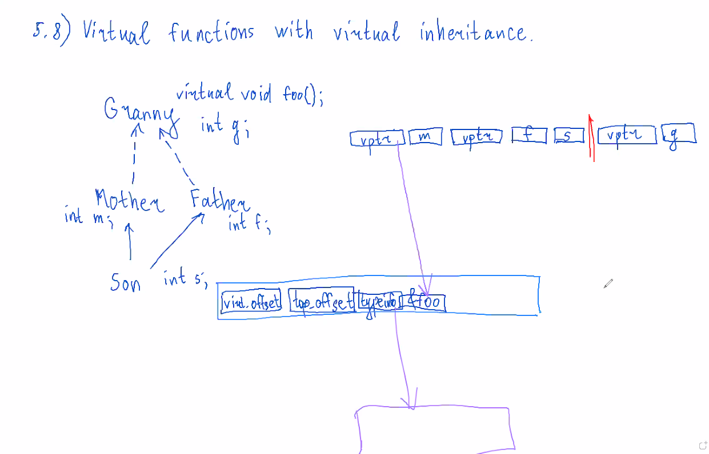

# V Полиморфизм и виртуальные функции

## 5.1 Idea of virtual function

```cpp
struct Base {
    void f() { std::cout << "Base\n";}
};
struct Derived: public Base {
    void f() { std::cout << "Derived\n";}
};
int main() {
    Derived d;
    Base& b = d;

    d.f(); // Derived
    b.f(); // Base
}
```
если написать (в `Base`) `virtual void f()...`, то `b.f();` выведет Derived. Если написать `d.Base::f();`, то выведется Base.

если потом убрать `&` (`Base b = d;`), то `b.f();` выведет Base.

## 5.2. Virtual and non-virtual functions combined
```cpp
...
struct GrandChild: public Derived {

};
int main() {
    GrandChild c;
    Base& b = c;
    b.f(); // Derived
}
```

```cpp
struct Base {
    virtual void f() const...
};
...
int main() {
    Derived d;
    Base& b = d;
    d.f(); // Derived
    b.f(); // Base, т.к. в Base есть const, а в Derived нет.
}
```
чтобы компилятор проверял такие случаи, нужно написать (в `Derived`) `void f() override...`.

Можно написать `void f() final...`, чтобы запретить переопределение далее в наследниках. Так можно делать только с `virtual` методами.

```cpp 
struct Base {
public:
    virtual void f() { std::cout << "Base\n";}
};
struct Derived: public Base {
private:
    void f() { std::cout << "Derived\n"; }
};
int main() {
    Derived d;
    Base& b = d;
    b.f(0); // выполнится несмотря на приватность, т.к. приватность нельзя проверить в RunTime
}
```

## 5.3. Abstract classes and pure virtual functions
```cpp
// Abstract class.
struct Base {
    // pure virtual function
    virtual void f(int) = 0;
};
```
в этом классе функция `void f(int)` не реализована, зато наследники Base обязаны ее реализовать.

Пример использования полиморфизма:
```cpp
...
struct Son: public Base {
    void f(int) override {
        std:: cout << "Son\n";
    }
};
struct Daughter: public Base {
    void f(int) override {
        std:: cout << "Daughter\n";
    }
};
int main() {
    std::vector<Base*> v;
    v.push_back(new Son());
    v.push_back(new Daughter());
    for (size_t i = 0; i < v.size(); ++i) {
        v[i]->f();
    }
    /*
    Son
    Daughter
    */
}
```

## 5.4. Virtual destructor problem.
```cpp
struct Base {
    int* bp = new int();
    ~Base  {
        std::cout << "Base\n";
        delete bp;
    }
};
struct Derived: public Base {
    int *dp = new int();
    ~Derived() {
        std::cout << "Derived\n";
        delete dp;
    }
}
int main() {
    Base* b = new Derived();
    delete b; // Base
}
```
нужно дописать `virtual ~Base`, чтобы работало корректно. (Но если сделать деструктор Base pure virtual, то после класса нужно будет написать `Base::~Base(){}` (иначе приведет к ошибке линкера). При этом класс Base останется абстрактным.)

Поэтому если ожидаете, что от вашего класса будут наследоваться, делайте деструктор `virtual`.

**Polymorphic type** - тип, у которого хотя бы одна virtual функция.

**Abstract type** - тип, у которого есть хотя бы одна pure virtual функция.

## 5.5. RTTI (run-time type information) and dynamic_cast.
**Статический тип** - тот тип, который видит компилятор, когда компилирует.

**Динамический тип** - тот тип, который выясняется во время выполнения.

Почему нельзя на этапе компиляции всё понять:
```cpp 
...
int main() {
    int n;
    std::cin >> n;
    Derived d;
    Base b;
    Base& bb = (n % 2)?b:d;
}
```

Чтобы явно узнать динамический тип:
```cpp
...
std::cout << typeid(bb).name;
```
если динамические типы одинаковые, то их `typeid(bb)` равны  (сравнение через `==`).

Не надо использовать `typeid`.

---

Пусть Son наследуется от Mom, Dad:
```cpp
int main() {
    Son s;
    Mom* m = &s;
    Dad* d = dynamic_cast<Dad*>(m);
}
```
`dynamic_cast` корректно приведет к нужному типу в RunTime. Если бы у него не получилось, он бы вернул `nullptr`. Но можно было бы написать `static_cast<Son*>`.

`dynamic_cast` только для полиморфных типов.

## 5.6. Vtables and layout of polymorphic objects.


---


если написать 
```cpp
Son s;
Granny& g = s;
```
то `g.f();` вызовет `Granny:f()`.

## 5.7. Virtual functions with multiple inheritance.
