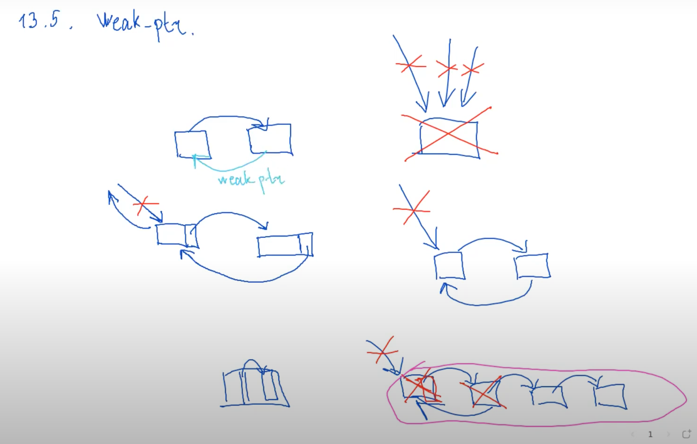
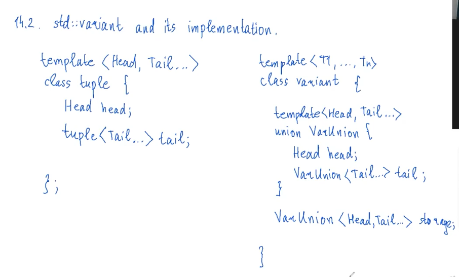

## 13.2. shared_ptr basic implementation
Реализация на двойку
```cpp
template <typename T>
class shared_ptr {
private:
    T* ptr = nullptr;
    size_t* counter;
public:
    shared_ptr() {}
    shared_ptr(T* ptr) : ptr(ptr), counter(new size_t(1)) {}
    shared_ptr(const shared_ptr& other) : ptr(other.ptr), count(other.count) {
        ++*counter;
    }
    shared_ptr(shared_ptr&& other) : ptr(other.ptr), counter(other.counter) {
        other.ptr = nullptr;
        other.counter = nullptr;
    }
    ~shared_ptr() {
        if (*counter > 1) {
            --*counter;
            return;
        }
        delete ptr;
        delete counter;
    }
    T& operator*() const {
        return *ptr;
    }
    T* operator->() const {
        return *counter;
    }
};
```
плохой код, т.к. от этого он нас не спасет:
```cpp
int* p = new int(5);
shared_ptr<int> sp = p;
shared_ptr<int> ssp = p;
```
## 13.3 make_shared, make_unique
```cpp
template <typename T, typename... Args>
shared_ptr<T> make_shared(Args&&... args) {

    auto ptr = new T(std::forward<Args>(args)...);
    return shared_ptr<T>(ptr);
}
```
Чтобы избавиться от проблем из прошлого пункта, хотим хранить counter и ptr рядом
```cpp
template <typename T, typename... Args>
shared_ptr<T> make_shared(Args&&... args) {
    auto ptr = new ControlBlock<T>{1, T{std::forward<Args>(args)...}};
    return shared_ptr<T>(shared_ptr::make_shared_t(), ptr);
}

template <typename T>
class shared_ptr {
private:
    //...

    template <typename U>
    struct ControlBlock {
        size_t counter;
        U object;
    };

    template<typename U, typename... Args>
    friend shared_ptr<U> make_shared(Args&&... args);

    struct make_shared_t;

    template <typename T>
    shared_ptr(make_shared_t, char* storage_ptr, Args&&... args) : cptr(storate_ptr) {
        
    }
    //...
};
```
но нужно будет много if'ать, чтобы понять, какой из указателей сейчас использутся. В stl какая-то другая реализация.
По аналогии есть фия `make_unique`.
```cpp
template <typename T, typename... Args>
unique_ptr<T> make_unique(Args&&... args) {
    return unique_ptr<T>(new T(std::forward<Args>(args)...));
}
```

"Пример, в очередной раз иллюстрирующий как ужасен язык C++":
```cpp
int f(int x) {
    //...
    if (x == 1)
        throw std::runtime_error("aaa!");
    return result;
}
void g(const unique_ptr<int>& ptr, int x) {
    //...
}
int main() {
    g(unique_ptr<int>(new int(5)), f(1));
}
```
компилятор не гарантирует, в каком порядке будут вычисляться параметры фий. Это еще один аргумент в пользу `make_unique`, т.к. она либо полностью выполнится, либо нет :).

## 13.5. weak_ptr
shared_ptr не спасает от циклических зависимостей. На помощь приходит weak_ptr.

Это неполная реализация, т.к. мы предполагаем, что shared_ptr создан через `ControlBlock`
```cpp
template <typename T>
class weak_ptr {
    ControlBlock<T>* cptr = nullptr;
public:
    weak_ptr(const shared_ptr<T>& ptr) : cptr(ptr.cptr) {

    }
    // убит ли
    bool expired() const {
        return cptr->counter == 0;
    }
    shared_ptr<T> lock() const {

    }
};
```
Модифицируем shared_ptr, чтобы shared_ptr мог работать с weak_ptr
```cpp
//...
template <typename U>
struct ControlBlock {
    size_t shared_count;
    size_t weak_count;
    U object;
};
//...
~shared_ptr() {
    *cptr->shared_count
    if (*cptr->shared_count > 0) {
        return;
    }
    if (cptr->weak_count == 0) {
        delete cptr;
        return;
    }
    cptr->object.~T();
}
```
```cpp
//...
~weak_ptr() {
    --cptr->weak_count;
    if (cptr->shared_count == 0 && cptr->weak_count == 0) {
        // deallocate   
    }
}
```
важно, что в некоторый случаях мы делаем destroy в shared_ptr, а deallocate в weak_ptr. 
## 13.5. allocate_shared.
Поскольку мы активно занимаемся выделением памяти, мы должны предоставить возможность выделять память через allocator
```cpp
template <typename T, typename Alloc, typename... Args>
shared_ptr<T> allocate_shared(Alloc& alloc, Args&&... args) {
    // тут жесть, так как мы должны хранить allocator в ControlBlock
}

template <typename T, typename... Args>
shared_ptr<T> make_shared(Args&&... args) {
    return allocate_shared(std::allocator<T>(), std::forward<Args>(args)...)
}
```
## 13.6. enable_shared_from_this. CRTP (Curiously Recursive Template Pattern)
Хотим получать shared_ptr на уже существующий объект. **Но так писать нельзя:**
```cpp
struct S {
    //...
    shared_ptr<S> get_ptr() const {
        return shared_ptr<S>(this);
    }
}:
```
т.к. на `S` уже может существовать shared_ptr.

На помощь приходит `enable_shared_from_this`. Как им пользоваться:
```cpp
struct S : public enable_shared_from_this<S> {
    //...
    shared_ptr<S> get_ptr() const {
        return shared_from_this();
    }
};
```
Реализация этого класса:
```cpp
template <typename T>
class enable_shared_from_this {
private:
    weak_ptr<T> wptr;
    template <typename U>
    friend class shared_ptr;
public:
    shared_ptr<T> shared_from_this() {
        return wptr.lock();
    }
};
```
но чтобы это работало, нужно поменять код shared_ptr
```cpp
//...
shared_ptr(T* ptr) : ptr(ptr), counter(new size_t(1)) {
    if constexpr(std::is_base_of_v<enable_shared_from_this<T>, T>) {
        ptr->wptr = /*...*/;
    }
}
//...
```
Важно понимать, что shared_ptr на объект на стеке делать не нужно (shared_ptr может пережить сам объект, что приведет к UB).
# XIV. Vocabulary types and type erasure idiom
pair, tuple, variant, any, optional.
optional позволяет хранить объект типа T, либо ничего. Нужен, например, чтобы из не `void` функции возвращать что-то, даже если посчитать не получилось.
variant позволяет хранить что-то из списка (int, string или ещё что-то).
any позволяет в себя класть что угодно (тратит память как максимум из памяти типов, которые в нем могут лежать).
## 14.1. Unions
```cpp
struct S {
    int i;
    double d;
    std::string str;
};
union U {
    int i;
    double d;
    std::string str;
    // имеем нетривиальные типы, поэтому нужно писать свой конструктор.
    U() {}
    ~U() {}
};
int main() {
    // 48 32
    std::cout << sizeof(S) << ' ' << sizeof(U);

    U u;
    u.i = 5;
    std::cout << u.i  << '\n';
}
```
При этом вот это приведет к seg fault:
```cpp
int main() {
    U u;
    u.str = "abc";
    std::cout << u.str.size() << '\n';
}
```
потому что присваивание означает удалить старое и создать новое. Поэтому нужно писать
```cpp
new (&u.str) std::string("abc");
```
**Active union member** - тот член Union, к которому обращение будет не UB (в который последней  была запись).
Union'ы могут быть шаблонными.
Union во многом не безопасен, поэтому был придуман variant.
## 14.2. std::variant and its implementation.
