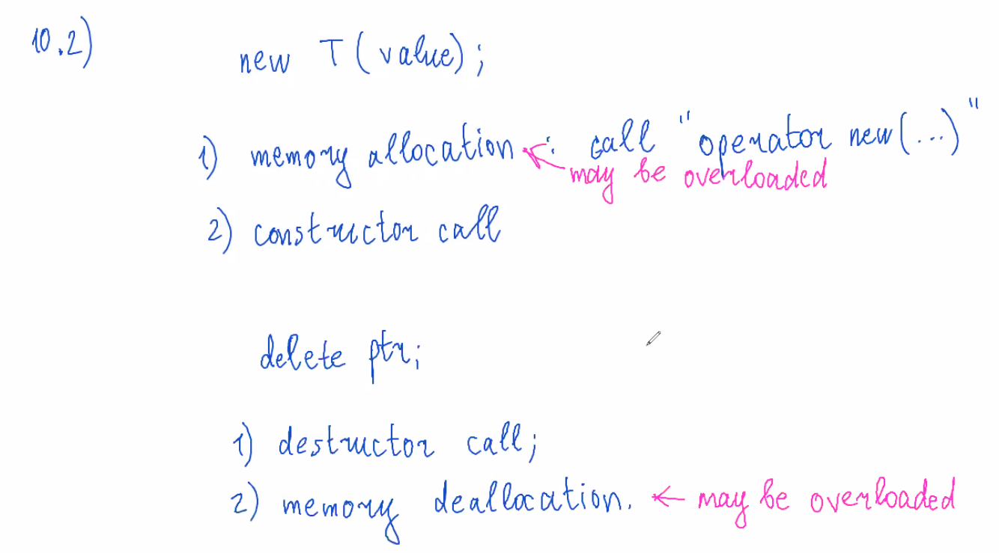
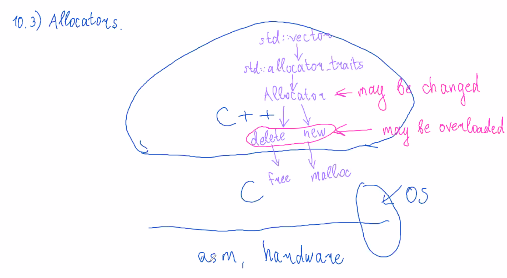
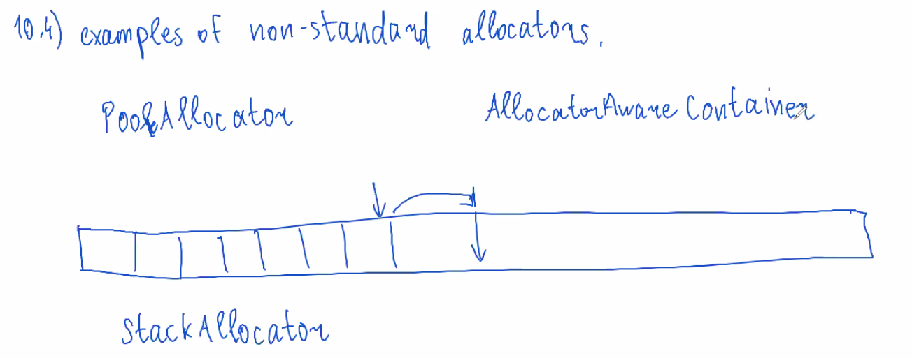

В stack можно в качестве контейнера передать, например, vector. Это называется **adapter**.

span - оболочка над контейнером, которая нужна, чтобы передавать её куда-то. 

Есть cppreference named requirements.
# X. New/delete overloading, allocators.
## 10.1. Standart new-delete overloading.
Перегрузили глобальный оператор new и delete:
```cpp
#include <cstdlib>

void* operator new(size_t n) {
    std::cout << "Allocated " << n << "bytes\n";
    return malloc(n); 
}
void operator delete(void* ptr, size_t n) {
    std::cout << "Deallocated " << n << "bytes\n";
    free(ptr);
}

void* operator new[](size_t n) {
    std::cout << "Allocated array " << n << "bytes\n";
    return malloc(n); 
}
void operator delete[](void* ptr) {
    std::cout << "Deallocated array\n";
    free(ptr);
}

int main() {
    int* a = new int(5);
    delete a;
    double* da = new double(3.14);
    delete da;
    int* arr = new int[3];
    delete[] arr;
}
```

## 10.2. 


Перегрузим оператор new для своего конкретного класса:
```cpp
struct S {
    int x = 0;
    double d = 0.0;

    static void* operator new(size_t n) {
        std::cout << "Allocated " << n << " bytes\n";
        return malloc(n);
    }
    static void operator delete(void* p) {
        std::cout << "Deallocated\n";
        free(p);
    }
};

int main() {
    S* p = new S();
    delete p;
}
```

Placement new:
```cpp
void* operator new(size_t /*n*/, void* ptr) {
    return ptr;
}
```
Nothrow new:
```cpp
void* operator new(size_t n, std::nothrow_t) {
    return malloc(n);
}

int main() {
    int* ptr = new(std::nothrow_t) int(5);
}
```
Свой тэг (можно даже несколько):
```cpp
struct mynew_t {};
mynew_t mytag;

void* operator new(size_t mynew_t) {
    ...
}
void operator delete(size_t n, mynew_t) {
    ...
}

int main() {
    int* ptr = new(mytag) int(4);
    ptr->~S();
    operator delete(ptr, mytag);
}
```
## 10.3. Allocators.

```cpp
template <typename T>
class allocator {
public:
    T* allocate(size_t count) const {
        return ::operator new(count * sizeof(T));
    }
    void deallocate(T* ptr, size_t /*count*/) {
        ::operator delete(ptr);
    }
    template <typename... Args>
    void construct(T* ptr, const Args&... args) {
        new(ptr) T(args);
    }
    void destroy(T* ptr) {
        ptr->~T();
    }
};  
```
Теперь чуть более правильная реализация Vector:
```cpp
template <typename T, typename Alloc = std::allocator<T>>
class Vector{
private:
    ...
    Alloc alloc;
public:
    Vector(size_t count, const T& value, const Alloc& alloc = Alloc()): alloc(alloc) {
        reserve(count);
        for (size_t i = 0; i < count; ++i) {
            allocator.construct(arr + i, value);s
        }
    }
    ...
};
/*
Теперь вместо 
T* newarr = reinterpret_cast<T*>(new int8_t[n * sizeof(T)]);
нужно написать
T* newarr = alloc.allocate(n);

вместо
delete[] reinterpret_cast<int8_t*>(arr);
нужно
alloc.deallocate(arr);

вместо
(newarr + i)->~T();
нужно
alloc.destroy(arr + i)

и еще заменить что-то на alloc.construct
*/
```
## 10.4. Examples of non-standard allocators.

## 10.5.
## 10.6. Allocatoc Traits
некоторые вещи теперь нужно заменить на allocator_traits
## 10.7. Allocator behaviour on container copying.
Решаем проблему, что делать с аллокатором при копировании другого вектора.