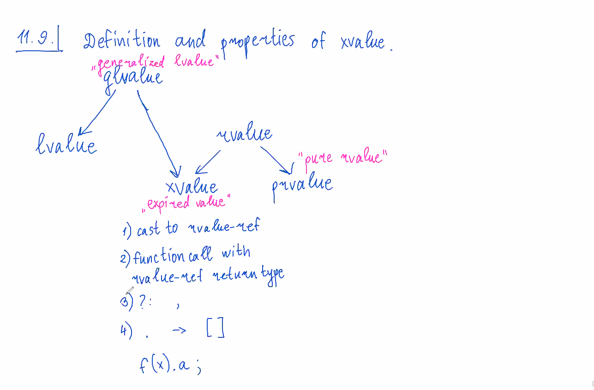

## 11.8. Perfect forwarding problem.
Пилили вектор. В нем использовали std::forward. Вот так он работает:
```cpp
template <typename T>
T&& forward(std::remove_reference<T>& x) {
    return static_cast<T&&>(x);
}
/*
case of lvalue:
T == type&
typeof(x) == type&
T&& == type&

case of rvalue:
T == type
typeof(x) == type&
T&& == type&&
*/
```
но есть вторая перегрузка forward:
```cpp
template <typenamt T>
T&& forward(std::remove_reference<T>&& x) {
    static_assert(!std::is_lvalue_reference_v<T>)
    return static_cast<T&&>(x);
}
```
## 11.9. Definition and properties of xvalue.

**temporary materialization** - это когда компилятор трактует prvalue как xvalue.
Пример:
```cpp
struct S { int m};
int i = S().m;
```
## 11.10. Reference qualifiers.
Метод `get_data()` применим только к rvalue
```cpp
struct Data {
    Data(const std::string& s): data(s) {}
    
    std::string get_data() & {
        return data;
    }
private:
    std::string data;
};

void f(Data&& x) {
    // CE
    std::string data = std::move(x).get_data();
}
```
но если дописать ещё перегрузку
```cpp
std::string get_data() && {
    return std::move(data);
}
```
то заработает.