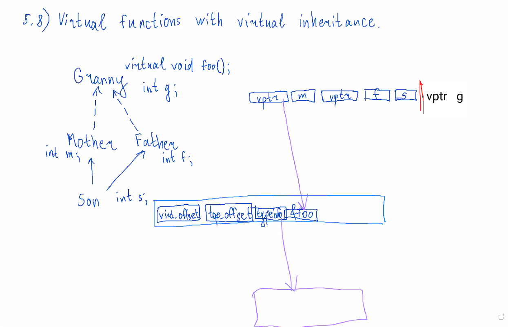

## 5.8. Virtual functions with virtual inheritance.

## 5.9. Some problems related to dynamic dispatching.
```cpp 
struct Base {
    virtual void f(int x = 1) const {
        std::cout << "Base" << x << '\n';
    }
};
struct Derived : public Base {
    void f(int x = 2) const override {
        std::cout << "Derived" << x << '\n';
    }
};

int main() {
    const Base& b = Derived();
    b.f(); // Derived 1
}
```
выбор параметра по умолчанию происходит в compile time.
```cpp 
struct Base {
    Base() {
        f(0);
    }
    virtual void f(int x) const {
        std::cout << "Base" << x << '\n';
    }
};
struct Derived :public Base {
    Derived() {
        f(1);
    }
    void f(int x) const override {
        std::cout << "Derived" << x << '\n';
    }
};

int main() {
    const Base& b = Derived();
    b.f(2); 
    // Base 0
    // Derived 1
    // Derived 2
}
```
в конструкторе `Base` еще не создано `Derived`, поэтому вызывается `Base::f`. В частном случае, если `f` - pure virtual, то будет UB.
```cpp 
struct Base {
    virtual void f();
}
int main() {
    Base b;
}
```
ошибка. Компилятор не смог создать виртуальную таблицу для `Base`, т.к. у функции нет определения.

---

Наименьший общий тип для двух типов:
```cpp {
#include <type_traits>

typename std::common_type<Son, Daughter>::type result;
//для экземпляров:
typename std::common_type<decltype(x), decltype(y)>::type result;
```

---

# VI. Templates.
## 6.1. Idea of template.
Шаблонная функция:
```cpp
template <typename T>
T my_max(T a, T b) {
    return a > b ? a : b;
}
```
адреса у функций `my_max` с `T = int` и c `T = double` разные. То для для разных типов это разные функции.

Шаблонный класс:
```cpp 
template <typename T>
struct S {

};
```

Шаблонный alias:
```cpp
template <typename T>
using umap = std::unordered_map<T, T>;
```

Шаблонная переменная:
```cpp
template <typename T>
T pi = 3.14
```

**Нельзя объявлять шаблоны внутри функций.**

Немного синтаксиса:
```cpp
template <typename U>
struct S {
    U x;
    template <typename T>
    void f(T a, U b);
}
template <typename U>
template <typename T>
void s<U>::(T a, U b) {}
```

`typename T` <=> `class T`, но по code style лучше писать `typename`.

## 6.2. Template functions overloading.
Точное соответствие лучше, чем что-либо другое.

Частное лучше, чем общее.

---

```cpp
template <typename T>
void g(T x) {
    std::cout << 1;
}

template<typename T>
void g(T& x) {
    std::cout << 2;
}

int main() {
    int x;
    g(x); // CE
}
```

```cpp
template <typename T>
void g(T& x) {
    std::cout << 1;
}

template<typename T>
void g(const T& x) {
    std::cout << 2;
}

int main() {
    const int x = 0;
    g(x); // 2
}
```

Значение `typename` по умолчанию. Без `= int` было бы CE.
```cpp
template<typename T, typename U = int>
void h(T x) {
    U y = 1;
    std::cout << y;
}

int main() {
    h(0);
}
```

## 6.3. Template specializations.
```cpp 
template <typename T>
struct S {
    T x = 0;
};

template <>
struct S<int> {
    int y = 0;
}
int main() {
    S<double> sd;
    S<int> si;
    si.x; // CE
}
```
Переопределить встроенный `hash`:
```cpp
namespace std {
    template <>
    struct hash<MyType> {
        ...
    };
}
```